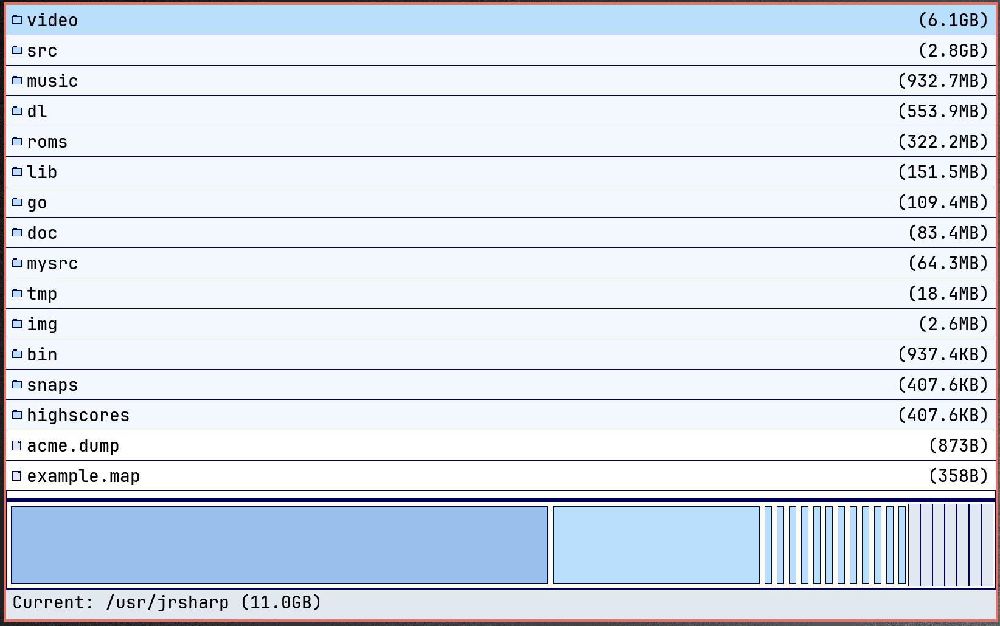

dufus
====

dufus (disk usage for us) is a simple disk usage analysis tool for 9front/Plan 9.

It is inspired by tools like QDirStat, it provides a graphical breakdown of the
on-disk usage of files and directories on a Plan 9 system.  It is meant to
adhere to Plan 9 design principles of simplicity and modularity, doing only the
essential tasks of collecting this file/directory usage information from the
underlying filesystem services and merely providing a basic libdraw visualization
that summarizes this data and allows the user to navigate their filesystem
visually.

## Enhanced Visualization

Dufus features an advanced visualization that better represents the recursive nature of filesystem structures. The visualization adapts to the underlying data, naturally revealing patterns that resemble fractal structures when the filesystem exhibits such organization.

Key features:
- Color gradient based on directory depth
- Adaptive layout patterns that change based on directory depth and available space
- Spiral layouts for certain directory levels, creating more organic representations
- Explicit visualization of recursive structures

## Fractal Filesystem Generator

The included `fractal_fs.rc` script lets you generate filesystem structures that resemble various fractal patterns:

```
./fractal_fs.rc [base_dir] [max_depth]
```

The script creates:
- Sierpinski triangle-like directory structures
- Mandelbrot-like patterns with varying branching factors
- Koch snowflake-like directory hierarchies
- Dragon curve-like recursive patterns

This provides an excellent demonstration of dufus's visualization capabilities, as the tool will naturally express the fractal nature of these generated filesystem structures.

## Screenshots

It looks like this:



Bugs:

yeah, we've got 'em.
